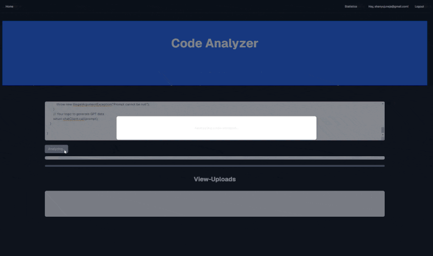
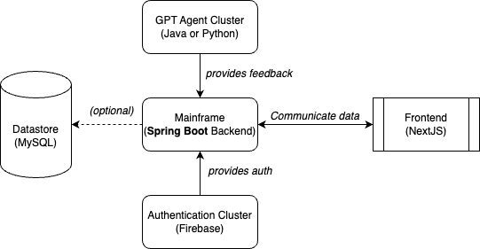

                                                                                                                              
<a align="center">
<pre align="center">
    ______   ______    _______   _______      ___      .__   __.      ___       __      ____    ____      _______. _______ .______      
 /      | /  __  \  |       \ |   ____|    /   \     |  \ |  |     /   \     |  |     \   \  /   /     /       ||   ____||   _  \     
|  ,----'|  |  |  | |  .--.  ||  |__      /  ^  \    |   \|  |    /  ^  \    |  |      \   \/   /     |   (----`|  |__   |  |_)  |    
|  |     |  |  |  | |  |  |  ||   __|    /  /_\  \   |  . `  |   /  /_\  \   |  |       \_    _/       \   \    |   __|  |      /     
|  `----.|  `--'  | |  '--'  ||  |____  /  _____  \  |  |\   |  /  _____  \  |  `----.    |  |     .----)   |   |  |____ |  |\  \----.
 \______| \______/  |_______/ |_______|/__/     \__\ |__| \__| /__/     \__\ |_______|    |__|     |_______/    |_______|| _| `._____|
</pre>                                                                                                                                 
</a>


<p align="center">
  <a></a>
  <a></a>
  <a></a>
</p>

---

CodeAnalyser is a fully functional, micro-service based, downtime resilient code analyser for single class inputs with GPT and Static analysis capabilities. It was originally designed to be multi-permeable and cross-compatible amongst languages to maintain cross-language support since we're working with LLMs. Since then, we have additionally added experimental language support (although anything other than Java would either require to move the microservice infrastructure to Apache Zookeeper/Consul to support rust, etc...). 

<p align="center">
  <a></a>
</p>
<p align="center">
    <i>Preview of the application using OpenAI GPT 3.5-turbo to analyse a Java class </i>
  <br><br>
    <a></a>
    <br>
    Watch the video on YouTube: https://youtu.be/QBnDkiyJ7D8
</p>

Overall, this application has the following features
- OpenAI GPT Support
- OLlama Llama 3 fallback if OpenAI is down
- Full code evaluation for any language (Java, JavaScript, Rust, etc...)
- Linting and display of suggestions according to type
- Scalable and deployable on demand
- Code storage with H2 Database
- Statistics page which displays average score and warning types

## Final project specifications
- [x] Source code. 
- [x] Test code (like unit test cases).
  - [ ] Mainframe tests
  - [x] CheckerFramework tests [[click here]](dev.codeanalyser.modules.analysis.java.checkerfwk/src/test/java/com/codeanalyser/analysis/java/checkfwk/)
  - [x] Spoon tests [[click here]](dev.codeanalyser.modules.analysis.java.spoon/src/test/java/com/codeanalyser/analysis/java/spoon/)
  - [x] Code storage tests [[click here]](dev.codeanalyser.modules.code-storage/src/test/java/com/codeanalyser/codestorage)
  - [ ] Llama tests (none required)
  - [ ] OpenAI tests (none required)
  - [x] Shop tests [[click here]](dev.codeanalyser.shop/src/test/java/com/codeanalyser/shop)
- [x] Documentation (optional, not required). It includes all written materials that accompany a software project, providing comprehensive information about its design, implementation, usage, maintenance, and other relevant aspects. 
  - [x] Mainframe documentation [[click here]](dev.codeanalyser.shop/README.md)
  - [x] Frontend documentation [[click here]](codeanalyser-frontend/README.md)
- [x] Readme file, including the following:
  - [x] Title and Introduction: The README should start with a clear title that succinctly describes the project. 
  - [x] Followed by a brief introduction that provides an overview of what the project is about and its purpose.
- [x] Installation Instructions: Step-by-step guidance on how to install and set up the project. [[click here]](#installation)
- [x] Configuration: Information on how to configure the project, including any settings, environment variables, or configuration files that may need customization. 
- [x] Datasets used in the system if any.
- [x] A video showing all the provided features of the proposed system.[[click here]](https://youtu.be/QBnDkiyJ7D8)
- [x] A contribution file, listing each team member’s contributions to the project. [[click here]](#contributions)

## Installation

### Requirements
To be able to deploy this, you will need the following:
- Docker (preferably LTS)
- Java JDK >= 17 

To deploy, one click command using Gradle

### Building

#### Windows
```bash
gradlew oneClickDeploy 
```

#### MacOS/Unix/Linux
```bash
./gradlew oneClickDeploy 
```

### Deploy
Once you have executed the previous step, you may deploy using the preset docker-compose
```
docker-compose up
```

You may optionally add the parameter `-d` to run in a detached status. The frontend will be deployed to https://localhost:3000

### Troubleshooting

##### I did not deploy OpenAI, and it hangs on OLlama fallback!
<details>
    <summary>Solution</summary>

There's an incredibly easy fix for this. First lets diagnose the issue with the service: 
```
docker-compose logs llama-agent
```

If this outputs an error similar to this:

```
llama-agent-1  | java.lang.RuntimeException: [404] Not Found - {"error":"model 'llama3' not found, try pulling it first"}
llama-agent-1  |        at org.springframework.ai.ollama.api.OllamaApi$OllamaResponseErrorHandler.handleError(OllamaApi.java:78) ~[spring-ai-ollama-0.8.1.jar:0.8.1]
llama-agent-1  |        Suppressed: reactor.core.publisher.FluxOnAssembly$OnAssemblyException:
llama-agent-1  | Error has been observed at the following site(s):
llama-agent-1  |        *__checkpoint ? HTTP POST "/generate" [ExceptionHandlingWebHandler]
```

Then you should run

```
docker-compose exec ollama ollama run llama3
```

</details>

## Modules
These are broken down into a microservice infrastructure, view the initial project graph below:



This infrastructure has since involved, notably containing the following changes:
- Datastore was renamed to code-storage. Still uses MySQL in a h2 local database
- Mainframe was renamed to Shop, service discovery was created and called Mainframe
- Authentication cluster is now Supabase, an opensource derivative of Firebase

Overall, the following modules exist:

| Module                                                                                                                     | Description                                                                                                                                                                                                                                                                                                                                                                                                               | Ports           | Author                               |
|----------------------------------------------------------------------------------------------------------------------------|---------------------------------------------------------------------------------------------------------------------------------------------------------------------------------------------------------------------------------------------------------------------------------------------------------------------------------------------------------------------------------------------------------------------------|-----------------|--------------------------------------|
| [mainframe](./dev.codeanalyser.mainframe)                                                                                  | Mainframe discovery service responsible for linking all microservices together.  This microservice relies on Netflix Eureka and serves as a linking point to all others. It also serves a dashboard on the static http root path.                                                                                                                                                                                         | 8761 (Private)  | Shanyu Thibaut Juneja                |
| [modules.analysis.checkerfwk](./dev.codeanalyser.modules.analysis.java.checkerfwk) [**Experimental**]                      | Experimental Checker Framework static analysis. Currently not functional due to an  internal error, however the intent was to bring additional context analysis of java code in aggregated generated prompts.                                                                                                                                                                                                             | 8090  (Private) | Shanyu Thibaut Juneja                |
| [modules.analysis.spoon](./dev.codeanalyser.modules.analysis.java.spoon)                                                   | Functional INRIA Spoon static analyser. Currently performs null parameter checks on functional Java code and is capable of being extended. **Future work**: Hook the Spoon framework natively inside of spring boot to bring  dependency injection to the core to easily add further analysis.                                                                                                                            | 8091 (Private)  | Shanyu Thibaut Juneja                |
| [modules.code-storage](./dev.codeanalyser.modules.code-storage)                                                            | Microservice responsible for storing the code in an h2 container database. In development, redeployment will clear said database as it is stored as a temp  container.                                                                                                                                                                                                                                                    | 8799 (Private)  | Shanyu Thibaut Juneja                |
| [modules.gpt.llama](./dev.codeanalyser.modules.gpt.llama)                                                                  | OLlama Agent proxy for a local OLlama deployment to be able to interact with a Llama3 agent directly through a REST Api.                                                                                                                                                                                                                                                                                                  | 8082 (Private)  | Shanyu Thibaut Juneja                |
| [modules.gpt.openai](./dev.codeanalyser.modules.gpt.openai)                                                                | OpenAI Agent proxy for the official OpenAI api to interact with ChatGPT directly through a REST Api. This includes a personal key.                                                                                                                                                                                                                                                                                        | 8081 (Private)  | Shanyu Thibaut Juneja                |
| [shared.codemodal](./dev.codeanalyser.shared.codemodal)                                                                    | Shared API to share DTOs regarding code modal. **UNIMPLEMENTED YET**                                                                                                                                                                                                                                                                                                                                                      | n/a             | Shanyu Thibaut Juneja                |
| [shop](./dev.codeanalyser.shop)                                                                                            | Main exposed API towards the web. Handles all logic regarding the application, including the prompt, the circuit breaking, the load balancing and the application logic/testing. This is the main "core" of the app which makes use of all  microservices to best serve the frontend.                                                                                                                                     | 8080 (Public)   | Shanyu Thibaut Juneja                |
| [frontend](./code-analyser-frontend)                                                                                       | Frontend written in Next.js. Makes use of both server and client-sided components  to establish JWT based authentication using Supabase. All user logic is handled directly via supabase, and all storage is done via Spring by server side token authentication. This allows for us to maintain OAuth support for all integrations for free with high resiliency, and spares us the troubles of creating our own system. | 3000 (Public)   | Shanyu Thibaut Juneja  & Sonny Zhang |

## Contributions

### Sonny Zhang
Main contributor to the implementations of frontend design and contributed to the front to backend connection. Accomplished the following:
- Created and connected the statistics page to the backend in its integrity
- Created the base component model for listing the generated code outputs
- Modified and prettified the home page
- Removed clutter from frontend
- Created the base model for the code input page
- Contributed to documentation

### Shanyu Juneja
Main contributor to the backend and significant contributions to the front end to backend connection and UI development and design.
Responsible for ideation. Accomplished the following:
- Created the mainframe service
- Created the main next.js template and core
- Implemented authentication and user management
- Created the backend in its integrity from A-Z
- Hooked and connected the code input form
- Responsible for the animations and the connection to the backend for code input
- Created the code view component with syntax highlighting, suggestions etc
- Added animations here and there
- Created documentation
- Wrote installation/readme page

---
